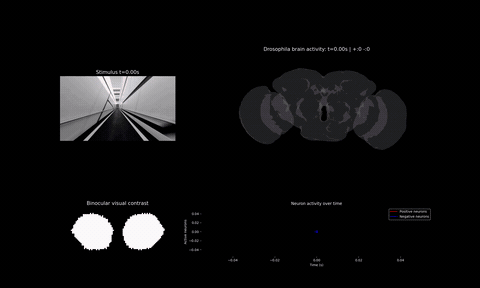

<p align="center">
  
</p>

<h1 align="center">Signal Infinite Cascade (SIC)</h1>

<p align="center">
  <em>A computational model for predicting neuron-level activity across the whole brain.</em>
</p>

<p align="center">
  
</p>


## 🧠 Overview

**SIC** is a model designed to predict neural activity across the entire brain.  
The SIC framework provides a unified approach for modeling neural dynamics in the **Drosophila visual system and other sensory modalities**.

Using the SIC model, researchers can achieve:

- **Improved prediction of neural activity**  
  The SIC model captures neural responses to visual stimuli with high stability and accuracy.

- **Generalization across sensory modalities**  
  The model successfully predicts neural dynamics in both visual and motion-related circuits, accurately reproducing inhibitory and excitatory interactions observed in experimental data.

- **Whole-brain, neuron-level simulation**  
  By incorporating partially measured neural activity as constraints, SIC can simulate responses of individual neurons across the entire brain under diverse conditions. This provides a comprehensive framework linking sensory inputs to whole-brain neural activity and enables new possibilities for digital life modeling.
  
## ✨ SIC Process

The SIC model aims to simulate large-scale neural dynamics by:

- Receiving **direct sensory inputs from real-world environments**
- Modeling **signal propagation across neural networks**
- Predicting **responses of neurons across the whole brain**

## 📊 Model Comparison

| Feature | DMN | LIF | SIC |
|------|------|------|------|
| Neural response | Type-level | Neuron-level | Neuron-level |
| Response representation | Detailed | Simplified | Detailed |
| Circuit-level function | Task-specific | Multiple tasks | Multiple tasks |
| Additional parameters | Parameter learning | Membrane potential | Measured activity |
| Inhibitory interactions | Explicit modeling | Partially nonfunctional | Explicit modeling |
| Brain coverage | Visual only | Whole brain | Whole brain |
| Sensory modalities | Visual | Multiple modalities | Multiple modalities |

---

## 🛠 Environment Setup

To set up the environment and install all necessary dependencies for this project, you can use the provided `requirements.in` file. 

Run the following command to install the required packages directly via `pip`:

```bash
pip install -r requirements.in
```

*(Optional)* If you manage your environments with `pip-tools`, you can compile it into a `requirements.txt` and sync your environment:

```bash
pip install pip-tools
pip-compile requirements.in
pip-sync
```

---

## 📦 Data Availability

The data used in this project can be obtained from the following resources:

- **Dataset repository (preprocessed FlyWire data):** https://zenodo.org/records/19213473  
  This repository provides a preprocessed version of the FlyWire dataset suitable for running the SIC model directly.

- **Detailed connectomics and neural data:** [FlyWire platform](https://codex.flywire.ai/api/download?dataset=fafb)  
  For access to the full-scale neural reconstructions and connectomics data.
  
## 🧬 3D Visualization of Neurons

To perform three-dimensional visualization of neurons, follow these steps:

1. **Download Neuron Skeletons** from the FlyWire dataset: [FlyWire Skeleton Files](https://codex.flywire.ai/api/download?dataset=fafb#collapseskeleton_swc_files)  
   These skeleton files are required for reconstructing 3D neuronal structures.

2. **Ensure dependencies are installed:**  
   The `navis` Python package and its dependencies are required for 3D reconstruction. This is automatically handled if you followed the **Environment Setup** instructions using the `requirements.in` file.
